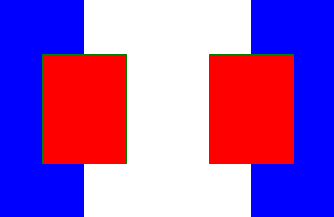

# Easily store and replot matplotlib Axes content

Have a plot that takes a long time to create and which you want to overlay
different things onto? You can use `matplotlib-aximgcache` to save the
intermediate axes content to an image and later replot that same content into a
new axes (in the right place with transparency!) All you need is
`.save_ax_to_image` and `.load_and_plot_image`, see below for an example (or
[example.ipynb](example.ipynb)).


## Installation

```
python -m pip install matplotlib-aximgcache
```

## Usage

First, we'll create a reference plot with some shapes that extend to the edges
of the figure and with whitespace in the middle so that we can test that
transparency works. At the end we call `.save_ax_to_image(...)` to save the
`matplotlib.Axes` content.

```python3
import matplotlib.pyplot as plt
import matplotlib.patches as mpatches
import matplotlib_aximgcache as mpl_aic

fig, ax = plt.subplots()
ax.set_xlim(0, 400)
ax.set_ylim(0, 200)

rects = [
    mpatches.Rectangle((0, 0), 100, 200, linewidth=1, edgecolor="none", facecolor="b"),
    mpatches.Rectangle(
        (400, 0), -100, 200, linewidth=1, edgecolor="none", facecolor="b"
    ),
    mpatches.Rectangle((50, 50), 100, 100, linewidth=1, edgecolor="g", facecolor="r"),
    mpatches.Rectangle((250, 50), 100, 100, linewidth=1, edgecolor="g", facecolor="r"),
]

for rect in rects:
    ax.add_patch(rect)

# save the content of the axes to a PNG-image so that it can be replotted
# into a new axes later
mpl_aic.save_ax_to_image(ax=ax, fpath="test.png")
```

The figure looks like this:


The stored image looks this (and contains meta-info so we can replot it in the
correct location):




Next, we create a new figure with an axes that has different extents than the
original axes and has some extra content (a few green rectangles) so we can
check alignment and transparency:

```python
fig, ax = plt.subplots(figsize=(8, 8))
ax.set_xlim(-200, 500)
ax.set_ylim(-200, 400)

# add a few green rectangles to show that with changed axes extents
# the loaded image is plotted in the correct place and has transparency
rect = mpatches.Rectangle(
    (100, 0), 20, 300, linewidth=1, edgecolor="none", facecolor="g"
)
ax.add_patch(rect)
rect = mpatches.Rectangle(
    (300, 0), -20, 300, linewidth=1, edgecolor="none", facecolor="g", zorder=2
)
ax.add_patch(rect)

# add the content of the previous figure's axes from the image stored above
# note that the loaded content is plotted with `zorder=1`, you can change
# this if you want to change the z-ordering relative to other things in your
# new figure
mpl_aic.load_and_plot_image(ax=ax, fpath="test.png")
```

The final figure looks like this:


## Contributing and inspiration

I got the technique for saving the axes content from `ImportantOfBeingErnest`
[on stackoverflow](https://stackoverflow.com/a/43099136/271776).

Pull-request welcome!
